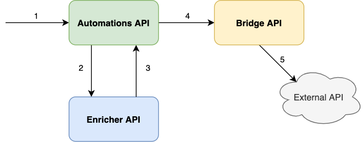

# Ruby Workshop - Tech Dojo 2020

The goal of this workshop is to build a small micro-service based application that receives events and executes actions in external systems. Each event and corresponding action constitutes an **automation**. Thus, we're building an automation execution service. 

The system is divided into three subcomponents:

- Automations API: responsible for receiving events and triggering actions. [[Repo](https://github.com/talkdesk-sandbox/tech-dojo-ruby-automations)]
- Enricher API: provide additional dynamic information. [[Repo](https://github.com/talkdesk-sandbox/tech-dojo-ruby-enricher)]
- Bridge API: convert and execute actions on external systems. [[Repo](https://github.com/talkdesk-sandbox/tech-dojo-ruby-bridge)]



Below is the full list of payloads expected in the application, according to the image numbering:

**Create ticket request (1)**

POST [`https://tech-dojo-ruby-automations.herokuapp.com/events`](https://tech-dojo-ruby-automations.herokuapp.com/events)

```json
{
  "event": "create",
  "contact_id": "id_1",
  "data": {
    "title": "This is a title",
    "description": "description",
    "status": "open",
    "name": "{{contact.name}}",
    "phone_number": "{{contact.phone_number}}"
  }
}
```

**Update ticket request (1)**

POST [`https://tech-dojo-ruby-automations.herokuapp.com/events`](https://tech-dojo-ruby-automations.herokuapp.com/events)

```json
{
  "event": "update",
  "contact_id": "id_1",
  "agent_id": "agent_id_1",
  "data": {
    "title": "{{agent.name}}",
    "status": "closed"
  }
}
```

**Delete ticket request (1)**

POST [`https://tech-dojo-ruby-automations.herokuapp.com/events`](https://tech-dojo-ruby-automations.herokuapp.com/events)

```json
{
  "event": "delete",
  "ticket_id": "t_id_1"
}
```

**Enricher API request (2)**

GET [`https://tech-dojo-ruby-enricher.herokuapp.com/enrich`](https://tech-dojo-ruby-automations.herokuapp.com/events)

```json
{
  "contact": {
    "id": "id",
    "fields": ["name", "phone"]
  },
  "agent": {
    "id": "id",
    "fields": ["name", "team"]
  }
}
```

**Enricher API response (3)**

```json
{
  "contact": {
    "id": "id",
    "name": "Peter John",
    "p": "+351111111111"
  },
  "agent": {
    "id": "id",
    "name": "John Peter",
    "team": "Integrations"
  }
}
```

**Bridge API request (4)**

POST [`https://tech-dojo-ruby-automations.herokuapp.com/tickets`](https://tech-dojo-ruby-automations.herokuapp.com/events)

```json
{
  "title": "This is a title",
  "description": "description",
  "status": "open",
  "name": "Peter John",
  "phone_number": "+351111111111"
}
```

**External API request (5)**

POST `https://mocky....`

```json
{
  "subject": "This is a title",
  "content": "description",
  "status": "open",
  "customer": {
    "name": "Peter John",
    "phone": "+35111111111"
  }
}
```

# Workshop Instructions

In this workshop, participants are divided into three groups. Each group will be responsible for a sub-component of our system (Automations, Enricher or Bridge API).

For each component, in the Issues section of the repository, there is a list of Use Cases in the format `UC0 - This is a use case` to be implemented according to number order.

**The goal of this workshop is to have every UC available in production.** All information necessary to develop each of the features is available in the issue or in this README.

Even though we're divided into three groups, we're are all part of the same team. So remember, we can (and should!) work together to be successful. If you're dependent on another team, talk with them and review their code.

Last but not least: **have fun!** 🎉

# Application Setup

Requirements:

- [Git](https://git-scm.com/) (check if already installed with `git --help`)
- [Ruby](https://www.ruby-lang.org/en/) (check if already installed with `ruby -v`)
- [Bundler](https://bundler.io/) (check if already installed with `bundle -v`)

Steps:

1. Clone repo
2. Go to app's root directory
3. Run `bundle install`
4. To run the application: `bundle exec ruby app.rb`
    - Server will be available at [http://localhost:4567](http://localhost:4567/)

# Development

1. Create a new branch.
    - e.g. `git checkout -b UCx-do-something`
2. Implement UC.
3. Check and fix linter offenses.
    - Run `bundle exec rubocop`
4. Add and commit changes.
    - `git add <files>`
    - `git commit -m "My message"`
    - `git push`
5. Open Pull Request.
    - This is done inside Github.
    - Add small description and reference to issue.
6. Send your PR to slack channel and let at least 1 of your teammates review it.
7. After approval, merge request with "squash and merge".
